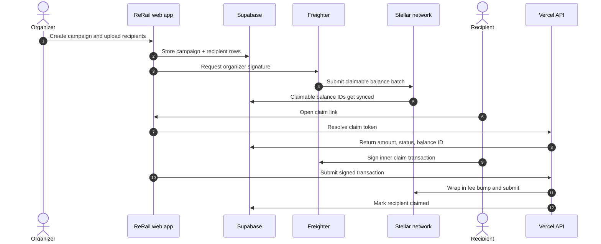

# ReRail

Gasless payout infrastructure on Stellar.

ReRail lets an organizer upload a recipient list, create on-chain claimable balances, and distribute USDC through shareable claim links. Recipients can claim without paying gas or holding XLM, while organizers keep full control over the treasury and payout timing.

## What it does

- Create campaigns from a CSV or manual recipient entries.
- Lock funds on Stellar with native claimable balances.
- Generate unique claim links for each recipient.
- Sponsor recipient claims, account activation, and trustlines.
- Mirror campaign activity to an optional Soroban registry for auditability.

## Highlights

- Non-custodial organizer flow with Freighter wallet signing.
- Gasless recipient claims through fee-bump transactions.
- CSV validation and sanitization for names, emails, wallet addresses, and amounts.
- Supabase-backed campaign, recipient, and transaction storage with RLS.
- Optional on-chain registry support for extra provenance.

## Architecture



## Tech Stack

| Area | Stack |
|---|---|
| Frontend | React 19, Vite, TypeScript |
| Styling | Tailwind CSS v4 |
| State | Zustand |
| Auth / DB | Supabase |
| Wallet | Stellar Wallets Kit + Freighter |
| Chain | `@stellar/stellar-sdk` |
| Serverless | Vercel Functions |
| Contracts | Soroban Rust contract (optional registry) |

## Repository Layout

```text
api/        Serverless endpoints for claims, sync, trustlines, and account sponsorship
contracts/  Soroban registry contract
docs/       Architecture, API, security, and Stellar integration notes
src/        React app, shared utilities, stores, and UI
supabase/   Database migrations, seed data, and Supabase config
```

## Getting Started

### Prerequisites

- Node.js 20+ or Bun 1.3+
- Freighter wallet extension
- Rust and Cargo if you want to work on the Soroban contract

### Install

```bash
git clone https://github.com/sukrit-89/CUSS.git rerail
cd rerail
bun install
```

If you prefer npm:

```bash
npm install
```

### Configure environment

Create a local env file and fill in your values:

```bash
cp .env.example .env.local
```

```env
VITE_SUPABASE_URL=https://your-project.supabase.co
VITE_SUPABASE_ANON_KEY=your-anon-key
VITE_HORIZON_URL=https://horizon-testnet.stellar.org
VITE_NETWORK_PASSPHRASE="Test SDF Network ; September 2015"
VITE_USDC_ISSUER=GBBD47IF6LWK7P7MDEVSCWR7DPUWV3NY3DTQEVFL4NAT4AQH3ZLLFLA5
VITE_CLAIM_LINK_BASE_URL=http://localhost:5174
```

### Run locally

```bash
bun run dev
```

Open the local URL printed by Vite in your terminal.

## Available Scripts

| Command | Description |
|---|---|
| `bun run dev` | Start the frontend development server |
| `bun run build` | Type-check and build the app |
| `bun run lint` | Run oxlint |

## Stellar Flow

### Campaign creation

1. Organizer signs in with Supabase Auth.
2. Campaign metadata and recipients are stored in Supabase.
3. The app builds `createClaimableBalance` transactions.
4. Organizer signs the batch in Freighter.
5. The signed transaction is submitted to Stellar.
6. Balance IDs are synced back to the database.

### Claim execution

1. Recipient opens `/claim/:token`.
2. The app resolves the claim token through the API.
3. Recipient signs the inner claim transaction.
4. The API wraps it in a fee bump transaction.
5. The transaction is submitted and the claim is marked complete.

## Environment Notes

- Claim links should use `VITE_CLAIM_LINK_BASE_URL` in local development.
- If that variable is unset, the app falls back to the current browser origin.
- Supabase service-role credentials are only required for deployed serverless routes.

## Security Model

- Organizers never hand over private keys.
- Recipient claims are tied to exact claim link tokens and wallet addresses.
- Amounts are validated as plain decimal strings with up to 7 fractional digits.
- Supabase RLS scopes organizer data to the authenticated user.
- CSV input is sanitized before import.

## Development Notes

- The repo includes a local Vite API router so `/api/*` works during `bun run dev`.
- The Supabase-backed routes are designed to run in Vercel Functions in production.

## License

MIT
