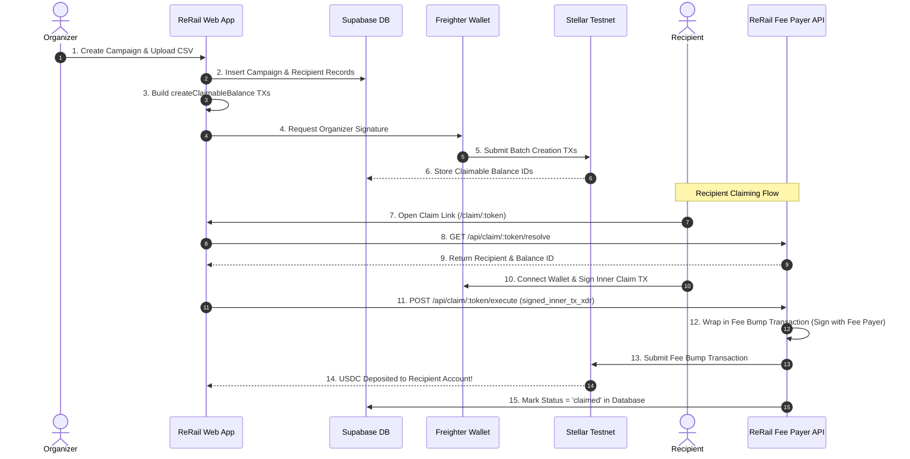

<div align="center">

# 🚂 ReRail

### Gasless Payout Infrastructure on Stellar

[](https://stellar.org)
[](https://soroban.stellar.org)
[](https://react.dev)
[](https://www.typescriptlang.org)
[](https://supabase.com)
[](LICENSE)

<br />

**Set up a grant. Send a link. Get paid — zero wallet setup or XLM required.**

[Explore Dashboard](https://rerail.vercel.app/dashboard) • [Claim Demo](https://rerail.vercel.app/claim/demo) • [Read Docs](docs/ARCHITECTURE.md)

</div>

---

## 💡 Executive Summary

Organizations frequently need to distribute funds to dozens or hundreds of recipients — hackathon prizes, scholarships, DAO contributor rewards, open-source bounties, and bootcamp stipends. Traditional payment methods suffer from high cross-border fees, slow settlements, and heavy manual overhead. Meanwhile, existing crypto distribution scripts force recipients to already own funded wallets with native gas tokens (XLM).

**ReRail solves this onboarding friction entirely.** Using **Stellar's native Claimable Balances** and **Fee Bump Transactions**, ReRail enables organizers to upload a CSV of recipients and generate unique claim links. Recipients click their link, connect a wallet (or create one sponsored by ReRail), and claim USDC instantly — **with zero gas fees and zero XLM required.**

---

## ✨ Key Features

| Feature | Description |
| :--- | :--- |
| **⚡ Gasless Payout Links** | Every claim is wrapped in a Stellar Fee Bump Transaction. ReRail sponsors transaction fees so recipients never pay gas. |
| **📁 Bulk CSV Upload & Validation** | Upload hundreds of recipients at once with real-time CSV parsing, injection protection, and Stellar Ed25519 public key validation. |
| **📊 Real-Time Campaign Dashboard** | Track total distributed USDC, active claim links, claim rates, and recipient states (`Pending`, `Claimed`, `Expired`). |
| **🛡️ Native Stellar Primitives** | Powered by first-class Stellar protocol primitives — `createClaimableBalance` and `claimClaimableBalance` — not simulated smart contract wrappers. |
| **📜 Soroban Contract Registry** | Optional on-chain campaign registry contract (`rerail_registry`) for immutable audit trails and contract-level verification. |
| **⏳ Automated Expiry & Reclaim** | Organizers enforce deadline predicates so unclaimed balances auto-expire after a set period and return to the organization treasury. |
| **🔐 Non-Custodial Security** | Organizers sign transactions in-browser via Freighter. Server-side fee payer keys are secured as environment secrets. |

---

## 🛠️ System Architecture



---

## 🌐 Stellar Integration Details

### 1. Claimable Balance Creation (Organizer Side)
Funds are locked on-chain per recipient using Stellar's native `createClaimableBalance` operation with time predicates:

```typescript
Operation.createClaimableBalance({
  asset: USDC_ASSET,
  amount: '250.00',
  claimants: [
    // Recipient can claim before deadline
    new Claimant(recipientPublicKey, Claimant.predicateBeforeRelativeTime('604800')),
    // Organizer can reclaim funds AFTER 7-day deadline
    new Claimant(organizerPublicKey, Claimant.predicateNot(Claimant.predicateBeforeRelativeTime('604800')))
  ]
});
```

### 2. Gasless Fee Bump Transaction (Recipient Side)
The recipient builds and signs an inner claim transaction (`claimClaimableBalance`). ReRail's serverless fee-payer node wraps it in a **Fee Bump Transaction** and submits it to Horizon:

```typescript
// Server-side fee-bump wrapping in api/claim/[token]/execute.ts
const feeBumpTx = TransactionBuilder.buildFeeBumpTransaction(
  FEE_PAYER_KEYPAIR,
  '1000', // Base fee covered by ReRail
  innerTx,
  Networks.TESTNET
);
feeBumpTx.sign(FEE_PAYER_KEYPAIR);
await server.submitTransaction(feeBumpTx);
```

### 3. Soroban Smart Contract (`rerail_registry`)
For full on-chain auditability, ReRail includes a custom Soroban smart contract written in Rust (`contracts/rerail_registry`).

```rust
// Core Registry Operations
pub fn create_campaign(env: Env, organizer: Address, name: String, asset: Address, default_amount: i128, total_pool: i128, deadline: u64) -> Result<u64, Error>;
pub fn register_recipient(env: Env, organizer: Address, campaign_id: u64, recipient: Address, amount: i128, claim_token_hash: BytesN<32>) -> Result<(), Error>;
pub fn mark_balance_created(env: Env, organizer: Address, campaign_id: u64, recipient: Address, balance_id: BytesN<32>) -> Result<(), Error>;
pub fn record_claim(env: Env, organizer: Address, campaign_id: u64, recipient: Address, tx_hash: BytesN<32>) -> Result<(), Error>;
```

---

## 📁 Repository Structure

```
rerail/
├── api/                       # Vercel Serverless Functions
│   └── claim/
│       └── [token]/
│           ├── execute.ts     # Fee bump wrapper & Horizon submitter
│           └── resolve.ts     # Claim token resolver endpoint
├── contracts/                 # Soroban Smart Contracts (Rust)
│   └── rerail_registry/
│       ├── Cargo.toml
│       └── src/
│           ├── lib.rs         # Campaign registry contract
│           └── test.rs        # 12 unit tests
├── docs/                      # Technical Documentation
│   ├── ARCHITECTURE.md
│   ├── API.md
│   ├── SECURITY.md
│   └── STELLAR_INTEGRATION.md
├── src/                       # Frontend React Application
│   ├── components/            # Reusable UI components (Sidebar, RecipientsTable)
│   ├── config/                # Centralized constants, env validation, Stellar assets
│   ├── features/              # Feature modules (auth, campaigns, claims, dashboard)
│   ├── lib/
│   │   ├── stellar/           # Stellar SDK utilities (fee-bump, claimable-balance, contract)
│   │   ├── supabase/          # Database client, queries, & generated types
│   │   └── utils/             # Validation, CSV sanitization, formatting
│   ├── pages/                 # HeroPage, ClaimPage, DashboardPage, NewPayoutPage, SettingsPage
│   └── stores/                # Zustand state stores (auth, campaign, wallet)
├── supabase/                  # Supabase Database Migrations & Schemas
│   └── migrations/
└── README.md
```

---

## 🚀 Quick Start & Local Setup

### Prerequisites
* **Node.js** v20+ or **Bun** v1.3+
* **Freighter Wallet Extension** installed in your browser
* **Rust & Cargo** (optional, for Soroban contract compilation)

### 1. Clone & Install
```bash
git clone https://github.com/sukrit-89/CUSS.git rerail
cd rerail
npm install
```

### 2. Configure Environment Variables
Copy `.env.example` to `.env.local` and add your project keys:
```bash
cp .env.example .env.local
```

```env
VITE_SUPABASE_URL=https://your-project.supabase.co
VITE_SUPABASE_ANON_KEY=your-anon-key
VITE_HORIZON_URL=https://horizon-testnet.stellar.org
VITE_NETWORK_PASSPHRASE="Test SDF Network ; September 2015"
VITE_USDC_ISSUER=GBBD47IF6LWK7P7MDEVSCWR7DPUWV3NY3DTQEVFL4NAT4AQH3ZLLFLA5
VITE_CLAIM_LINK_BASE_URL=http://localhost:5173
```

### 3. Run Frontend Development Server
```bash
npm run dev
```
Open `http://localhost:5173` in your browser.

---

## 🧪 Testing & Verification

### Run Frontend Build
```bash
npm run build
```

### Run Soroban Contract Tests
```bash
npm run contracts:test
```
*Output:*
```
running 12 tests
test test::create_campaign_without_auth_panics - should panic ... ok
test test::constructor_sets_admin_and_zero_count ... ok
test test::create_campaign_requires_organizer_auth_and_stores_data ... ok
test test::register_recipient_stores_pending_record_and_token_hash ... ok
test test::record_claim_marks_recipient_and_completes_campaign_when_all_claimed ... ok
...
test result: ok. 12 passed; 0 failed; 0 ignored
```

---

## 🔒 Security Model

* **Non-Custodial:** Organizers sign campaign creation transactions directly using Freighter in their browser. ReRail never stores organizer private keys.
* **Server-Side Fee Payer:** Fee payer secret keys live strictly in Vercel environment secrets (`FEE_PAYER_SECRET`) and are never bundled into client JS.
* **High Entropy Links:** Claim URLs use UUID v4 tokens ($2^{122}$ entropy space), making links impossible to enumerate or brute-force.
* **Row Level Security (RLS):** Supabase database policies isolate organizer data (`organizer_id = auth.uid()`).
* **CSV Injection Defense:** Input fields starting with `=`, `+`, `-`, or `@` are sanitized automatically.

---

## 🤝 Contributing & Community

Contributions, issues, and feature requests are welcome!

1. Fork the Project
2. Create your Feature Branch (`git checkout -b feature/AmazingFeature`)
3. Commit your Changes (`git commit -m 'Add some AmazingFeature'`)
4. Push to the Branch (`git push origin feature/AmazingFeature`)
5. Open a Pull Request

---

## 📄 License

Distributed under the MIT License. See `LICENSE` for more information.

<div align="center">
Built with ❤️ for the Stellar Ecosystem.
</div>
